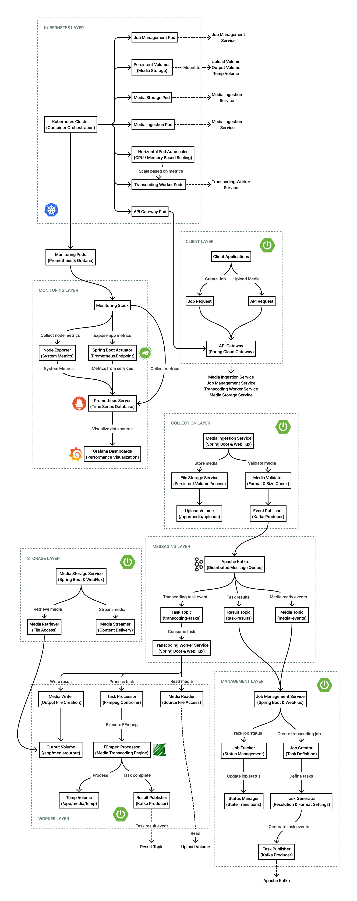

# 픽시스케일

픽시스케일은 대용량 미디어 처리 환경에서 쿠버네티스의 자동 스케일링 기능을 활용한 고성능 트랜스코딩 시스템입니다. CPU/GPU 집약적인 미디어 변환 작업을 효율적으로 처리하는 마이크로서비스 아키텍처를 구현하고, Horizontal Pod Autoscaler(HPA)를 통해 다양한 부하 패턴에서의 자동 스케일링 효과를 검증합니다. 대규모 트래픽 처리가 필요한 엔터프라이즈 환경에서 최적의 리소스 활용과 안정적인 서비스 제공을 위한 클라우드 네이티브 접근법을 제시합니다.

## 목차

1. [프로젝트 핵심 성과](#프로젝트-핵심-성과)
2. [주요 기능](#주요-기능)
3. [기술 스택](#기술-스택)
4. [시스템 아키텍처](#시스템-아키텍처)
5. [기술적 도전과 해결 방법](#기술적-도전과-해결-방법)
6. [성능 테스트 및 분석](#성능-테스트-및-분석)
7. [설치 및 실행 방법](#설치-및-실행-방법)
8. [API 문서](#api-문서)
9. [라이선스](#라이선스)

## 프로젝트 핵심 성과

### GPU 가속 환경

| 메트릭 | 성과 | 비고 |
| --- | --- | --- |
| 트랜스코딩 속도 | 평균 19.7초 | 30MB 비디오 파일 기준 |
| 최대 동시 처리 작업 | 6개 | 단일 인스턴스 환경 |
| 최대 처리량 | 17개/분 | 일관된 처리 속도 유지 |
| 작업 성공률 | 100% | 모든 테스트 작업 성공 |
| 대기 작업 처리 | 최대 129개 | 단일 인스턴스로 처리 완료 |

### 쿠버네티스 환경

| 메트릭 | 성과 | 비고 |
| --- | --- | --- |
| 트랜스코딩 속도 | 평균 47.5초 | 1.5MB 비디오 파일 기준 |
| 자동 스케일링 | 2→5 파드 | 부하 증가에 따른 자동 확장 |
| 최대 동시 처리 작업 | 23개 | 5개 파드 환경 |
| 최대 처리량 | 20개/분 | 최대 부하 시점 |
| 시스템 복원력 | 파드 재시작 상황에서도 작업 지속 | 리브니스 프로브 작동 확인 |

픽시스케일는 두 가지 환경에서 미디어 트랜스코딩 성능과 확장성을 테스트했습니다. GPU 가속 환경에서는 단일 인스턴스로도 뛰어난 처리 속도(평균 19.7초)와 완벽한 작업 성공률(100%)을 달성했습니다. 특히 최대 129개의 대기 작업을 안정적으로 처리하며 GPU 하드웨어 가속의 효율성을 입증했습니다.

GPU 가속을 사용하지 않는 쿠버네티스 환경에서는 트랜스코딩 속도(평균 47.5초)는 다소 느렸지만, 자동 스케일링과 시스템 복원력 측면에서 우수한 성능을 보여주었습니다. 부하 증가에 따라 파드가 2개에서 5개로 자동 확장되었고, 파드 재시작 상황에서도 작업 처리가 중단 없이 지속되었습니다. 특히 5개 파드 환경에서 최대 23개의 동시 작업 처리와 분당 20개의 처리량을 달성한 점은 주목할 만합니다.

향후 GPU 가속과 쿠버네티스 자동 스케일링의 장점을 결합한 통합 환경을 구축한다면, 고성능과 확장성을 모두 갖춘 최적의 미디어 트랜스코딩 시스템을 실현할 수 있을 것으로 기대됩니다.

## 주요 기능

### 1. 미디어 처리 파이프라인
- 다양한 형식/해상도의 비디오 파일 수집 및 처리
- 실시간 트랜스코딩 및 포맷 변환(H.264, H.265, VP9)
- 적응형 스트리밍을 위한 다중 해상도 변환(1080p, 720p, 480p, 360p)
- 병렬 처리를 통한 트랜스코딩 속도 최적화

### 2. 쿠버네티스 자동 스케일링
- CPU/메모리 사용률 기반 HPA 구성
- 작업 대기열 길이 기반 커스텀 메트릭 스케일링
- 다양한 스케일링 정책(빠른 스케일 아웃, 점진적 스케일 인) 구현

### 3. 마이크로서비스 아키텍처
- 5개의 독립적인 마이크로서비스 구성
- 미디어 수집, 작업 관리, 트랜스코딩 워커, 미디어 저장 등 기능별 분리
- Kafka를 통한 이벤트 기반 비동기 통신
- API 게이트웨이를 통한 요청 라우팅 및 로드 밸런싱

### 4. 모니터링 및 분석
- Prometheus와 Grafana를 통한 시스템 모니터링
- 실시간 처리량 및 지연시간 추적
- 스케일링 이벤트 감지 및 효과 측정
- 리소스 사용률 분석 및 최적화

## 기술 스택

### 백엔드 프레임워크
- Java 17: 최신 Java 기능 활용
- Spring Boot 3.5.4: 마이크로서비스 개발 기반
- Spring WebFlux: 비동기 및 논블로킹 I/O 처리
- Gradle: 빌드 및 의존성 관리

### 마이크로서비스 컴포넌트
- Spring Cloud Gateway: API 게이트웨이 구현
- Kafka: 마이크로서비스 간 메시지 통신

### 미디어 처리
- FFmpeg: 비디오 트랜스코딩 및 변환
- NVIDIA FFmpeg: GPU 가속 지원 통합

### 클라우드 네이티브
- Kubernetes: 컨테이너 오케스트레이션
- Horizontal Pod Autoscaler: 자동 스케일링
- Docker: 컨테이너화
- Minikube: 로컬 쿠버네티스 개발 환경

### 모니터링 및 가시성
- Prometheus: 메트릭 수집
- Grafana: 대시보드 및 시각화
- Spring Boot Actuator: 애플리케이션 모니터링
- Node Exporter: 시스템 메트릭 수집

### 스토리지
- Kubernetes Persistent Volume: 미디어 파일 저장

### 테스트 및 품질 관리
- JUnit 5: 단위 테스트 및 통합 테스트
- Spring Boot Test: 스프링 컴포넌트 테스트
- Shell Script: 커스텀 부하 테스트 스크립트

## 시스템 아키텍처

픽시스케일은 효율적인 미디어 트랜스코딩과 자동 확장성을 제공하는 마이크로서비스 기반 아키텍처로 설계되었습니다. 쿠버네티스의 HPA(Horizontal Pod Autoscaler)를 활용하여 워크로드에 따라 트랜스코딩 자원을 동적으로 조절하며, Kafka를 통한 이벤트 기반 통신으로 시스템 컴포넌트 간의 느슨한 결합을 구현했습니다. 컨테이너화된 서비스 구조는 개별 컴포넌트의 독립적인 확장과 업데이트를 가능하게 하며, 영구 볼륨을 활용한 안정적인 미디어 파일 관리 시스템을 제공합니다.

시스템은 다음과 같은 계층으로 구성되어 있습니다.

1. 클라이언트 계층: 외부 클라이언트 요청을 수신하고 API 게이트웨이를 통해 적절한 마이크로서비스로 라우팅합니다. Spring Cloud Gateway가 이 계층에서 중앙 진입점 역할을 수행합니다.

2. 수집 계층: 미디어 파일 업로드와 초기 검증을 담당하는 Media Ingestion Service를 포함합니다. 이 서비스는 Spring Boot와 WebFlux를 기반으로 비동기 방식의 파일 처리를 수행하며, 검증된 파일을 영구 볼륨에 저장하고 처리 이벤트를 발행합니다.

3. 관리 계층: 트랜스코딩 작업 생성 및 상태 관리를 담당하는 Job Management Service를 포함합니다. 미디어 파일에 대한 트랜스코딩 작업을 정의하고, 처리 상태를 추적하며, Kafka를 통해 트랜스코딩 작업을 워커 서비스에 전달합니다.

4. 메시징 계층: Apache Kafka를 기반으로 한 분산 메시징 시스템으로, 마이크로서비스 간의 비동기 통신을 담당합니다. 미디어 이벤트, 트랜스코딩 작업, 작업 결과 등의 메시지가 전달되며, 시스템 전체의 이벤트 흐름을 관리합니다.

5. 워커 계층: 실제 미디어 트랜스코딩을 수행하는 Transcoding Worker Service를 포함합니다. FFmpeg을 활용하여 다양한 형식과 해상도의 트랜스코딩을 처리하며, 쿠버네티스 HPA에 의해 워크로드에 따라 자동으로 확장됩니다.

6. 스토리지 계층: 트랜스코딩된 미디어 파일의 관리와 제공을 담당하는 Media Storage Service를 포함합니다. 워커 계층에서 처리된 결과물에 접근하여 클라이언트에게 제공하며, 효율적인 파일 접근 메커니즘을 제공합니다.

7. 쿠버네티스 계층: 컨테이너 오케스트레이션과 자동 확장을 담당하는 인프라 계층입니다. 모든 마이크로서비스의 배포, 스케일링, 네트워킹을 관리하며, 특히 HPA를 통해 트랜스코딩 워커의 자동 확장을 구현합니다.

8. 모니터링 계층: Prometheus와 Grafana를 활용한 시스템 모니터링 및 시각화를 담당합니다. 각 마이크로서비스의 성능 지표와 쿠버네티스 클러스터의 상태를 실시간으로 수집하고 분석하여 시스템 전반의 상태를 파악할 수 있게 합니다.



## 기술적 도전과 해결 방법

픽시스케일은 다음과 같은 기술적 과제를 해결했습니다.

### 1. GPU 가속과 다중 파드 CPU 처리 성능 비교 분석

도전 과제: 단일 인스턴스 GPU 가속과 다중 파드 CPU 기반 처리 간의 정확한 성능 비교 필요

해결 방법:
- NVIDIA CUDA 기반 FFmpeg 통합으로 GPU 하드웨어 가속 지원
- 환경 변수를 통한 GPU 가속 설정 동적 전환 구현

결과:
- 단일 GPU 인스턴스(19.7초)가 5개 CPU 파드 환경(47.5초)보다 2.4배 빠름
- CPU 환경은 최대 동시 처리 작업 수 23개로 GPU 환경(6개)보다 높음
- GPU 환경(100%)이 CPU 환경(97%)보다 높은 작업 성공률 제공

### 2. 쿠버네티스 HPA를 활용한 자동 스케일링 구현

도전 과제: 트랜스코딩 요청의 급격한 증가에 효율적으로 대응하면서 유휴 시간에는 리소스 낭비를 최소화해야 함

해결 방법:
- CPU(50%) 및 메모리(60%) 사용률 기반 HPA 구성
- 빠른 스케일 아웃(10초 안정화)과 점진적 스케일 인(300초 안정화) 정책 설계

```yaml
apiVersion: autoscaling/v2
kind: HorizontalPodAutoscaler
metadata:
  name: transcodingworker-hpa
  namespace: pixiescale
spec:
  scaleTargetRef:
    apiVersion: apps/v1
    kind: Deployment
    name: transcodingworker
  minReplicas: 1
  maxReplicas: 5
  metrics:
    - type: Resource
      resource:
        name: cpu
        target:
          type: Utilization
          averageUtilization: 50
    - type: Resource
      resource:
        name: memory
        target:
          type: Utilization
          averageUtilization: 60
  behavior:
    scaleUp:
      stabilizationWindowSeconds: 10
      policies:
        - type: Pods
          value: 1
          periodSeconds: 60
    scaleDown:
      stabilizationWindowSeconds: 300
      policies:
        - type: Pods
          value: 1
          periodSeconds: 120
```

결과:
- 부하 테스트에서 파드가 2개에서 5개로 자동 확장됨
- 최대 151개의 대기 작업 효율적 처리 완료
- 파드 재시작 상황에서도 작업 손실 없이 처리 지속

### 3. 이벤트 기반 마이크로서비스 아키텍처로 응답 시간 최적화

도전 과제: 긴 처리 시간이 필요한 트랜스코딩 작업에서도 사용자에게 빠른 응답 제공 필요

해결 방법:
- Kafka를 활용한 비동기 이벤트 기반 아키텍처 구현
- 작업 생성과 처리 과정의 분리
- 토픽 파티셔닝(10개)을 통한 병렬 처리 최적화

결과
- 트랜스코딩 요청에 대해 작업 생성 즉시 응답 반환, 실제 처리는 백그라운드에서 진행
- 대용량 파일 처리에도 API 응답 지연 최소화

### 4. 리브니스/레디니스 프로브를 통한 시스템 안정성 확보

도전 과제: 고부하 상황에서 일부 컴포넌트 장애 발생 시에도 전체 시스템의 안정성 유지 필요

해결 방법:
- Spring Boot Actuator 기반 헬스 엔드포인트 구현
- 트랜스코딩 워커에 적절한 프로브 설정(초기 지연 120초, 실패 임계값 5회)

결과:
- 부하 테스트 중 일부 파드가 헬스체크 실패로 재시작되어도 HPA가 계속 작동하여 파드 수 유지
- 시스템이 중단 없이 작업 처리 지속

## 성능 테스트 및 분석

픽시스케일 시스템의 성능 평가를 위해 다양한 환경에서 부하 테스트를 수행하고 그 결과를 분석했습니다. 테스트는 CPU 기반 쿠버네티스 환경과 GPU 가속 도커 환경에서 각각 진행되어 두 접근 방식의 효율성과 확장성을 비교할 수 있었습니다.

아래 성능 분석에 활용된 모든 지표와 그래프는 [GPU 가속 환경 대시보드](https://snapshots.raintank.io/dashboard/snapshot/LIsn10xCKTx9XA52TTcbmZ1tUbwwQCfA?orgId=0&refresh=5s)와 [쿠버네티스 환경 대시보드](https://snapshots.raintank.io/dashboard/snapshot/naZrQd9COBwewhe3p5oWHzXxMcl98hK6?orgId=0&refresh=5s)에서 자세하게 확인하실 수 있습니다.

### 테스트 환경 및 조건

테스트는 다음과 같은 환경에서 수행되었습니다.

- CPU 기반 쿠버네티스 환경
    - Windows 호스트 상의 WSL2 기반 Minikube 클러스터
    - 트랜스코딩 워커: 초기 1개, HPA를 통해 최대 5개로 확장
    - 샘플 파일: 1.5MB MP4 비디오

- GPU 가속 도커 환경
    - Docker Compose 기반 로컬 환경
    - NVIDIA CUDA GPU 가속 활성화
    - 샘플 파일: 30MB MP4 비디오

모든 테스트는 커스텀 스크립트를 사용하여 피보나치 수열 패턴(1, 1, 2, 3, 5, 8, 13, 21, 34, 55)으로 점진적으로 증가하는 부하를 생성했으며, 최대 부하(55 요청/분)에 도달한 후 테스트를 종료했습니다. 이러한 점진적 부하 증가는 실제 프로덕션 환경에서 발생할 수 있는 급격한 트래픽 증가를 시뮬레이션하기 위해 설계되었습니다.

### 측정 지표

다음 지표를 통해 시스템 성능을 평가했습니다.

- 트랜스코딩 처리 시간: 비디오 파일 트랜스코딩에 소요되는 평균 및 최대 시간
- CPU 및 메모리 사용률: WSL2 환경 내 리소스 사용 패턴 (호스트 OS 전체 리소스와 별개)
- 동시 처리 작업 수: 동시에 처리 중인 트랜스코딩 작업 수
- 대기 작업 수: 처리 대기 중인 작업 수
- 파드 스케일링: 쿠버네티스 HPA에 의한 파드 수 변화
- 작업 성공률: 성공적으로 완료된 작업의 비율

### CPU 기반 쿠버네티스 환경 결과

| 측정 항목 | 평균 | 최대 | 비고 |
| --- | --- | --- | --- |
| 트랜스코딩 처리 시간 | 47.5초 | 1분 9초 | 해상도별 변환 작업 포함 |
| 처리 중인 작업 수 | 4.86개 | 23개 | 파드 확장에 따라 증가 |
| 대기 작업 수 | 34.8개 | 151개 | 부하 최고점(55 요청/분)에서 발생 |
| 파드 수 | 4.66개 | 5개 | CPU/메모리 사용률에 따라 자동 확장 |
| 완료된 작업 | 2개/분 | 20개/분 | 최대 부하 시점에서 처리량 감소 |
| 실패한 작업 | 1개/분 | 13개/분 | 고부하 시점에서 발생 |

CPU 기반 환경에서는 부하 증가에 따라 HPA가 트랜스코딩 워커 파드를 초기 2개에서 최대 5개까지 자동으로 확장했습니다. 트랜스코딩 처리 시간은 평균 47.5초로 측정되었으며, 최대 부하 상황에서는 1분 9초까지 증가했습니다. Node Exporter를 통해 측정된 WSL 환경 내 CPU 사용률은 최대 40-50%로 기록되었으나, 이는 WSL2 환경에 할당된 리소스 내에서의 사용률로, 호스트 Windows OS의 전체 리소스 사용률과는 차이가 있습니다.

주목할 만한 점은 최대 부하 상황(55 요청/분)에서 대기 작업 수가 151개까지 증가했으며, 이 과정에서 일부 메트릭 수집이 불연속적으로 중단되는 현상이 관찰되었습니다. 이는 고부하 상황에서 일부 파드가 리브니스 프로브 응답 실패로 재시작되었음을 시사합니다. 그럼에도 불구하고 HPA가 지속적으로 파드를 최대 설정값인 5개로 유지하면서 시스템이 작업 처리를 계속할 수 있었습니다. 이러한 결과는 쿠버네티스의 자동 확장과 자가 복구 메커니즘이 동시에 작동하는 모습을 보여줍니다.

### GPU 가속 도커 환경 결과

| 측정 항목 | 평균 | 최대 | 비고 |
| --- | --- | --- | --- |
| 트랜스코딩 처리 시간 | 19.7초 | 24.8초 | CPU 환경보다 59% 빠름 |
| 처리 중인 작업 수 | 3.74개 | 6개 | 단일 인스턴스에서 처리 |
| 대기 작업 수 | 36.2개 | 129개 | 단일 인스턴스 한계에도 효율적 처리 |
| 완료된 작업 | 10개/분 | 17개/분 | 일관된 처리 속도 유지 |
| 실패한 작업 | 0개 | 0개 | 100% 성공률 |

GPU 가속 환경에서는 단일 트랜스코딩 워커 인스턴스만 사용했음에도 평균 19.7초의 처리 시간을 기록했으며, 이는 CPU 기반 환경보다 약 59% 빠른 성능입니다. 특히 주목할 만한 점은 처리 시간의 일관성으로, 최대값이 24.8초로 평균에서 크게 벗어나지 않았습니다.

또한 GPU 가속 환경에서는 테스트 전 과정에서 작업 실패가 발생하지 않았으며, 이는 하드웨어 가속을 통한 안정적인 처리 능력을 보여줍니다.

### 환경별 성능 비교

다음 표는 두 환경 간의 주요 성능 지표를 비교합니다.

| 측정 항목 | CPU 기반 쿠버네티스 | GPU 가속 도커 | 성능 차이 |
| --- | --- | --- | --- |
| 평균 처리 시간 | 47.5초 | 19.7초 | GPU 환경 59% 빠름 |
| 최대 처리 시간 | 1분 9초 | 24.8초 | GPU 환경 64% 빠름 |
| 최대 동시 처리 작업 | 23개 (5개 파드) | 6개 (1개 인스턴스) | CPU 환경 283% 더 많음 |
| 분당 완료 작업 (최대) | 20개 | 17개 | CPU 환경 18% 더 많음 |
| 작업 성공률 | 97% | 100% | GPU 환경 3% 더 높음 |

이 비교는 각 접근 방식의 장단점을 명확히 보여줍니다. GPU 가속 환경은 처리 속도와 안정성 측면에서 우수한 성능을 보여주는 반면, CPU 기반 쿠버네티스 환경은 HPA를 통한 수평 확장으로 더 많은 동시 작업을 처리할 수 있었습니다.

### 시스템 안정성 및 회복력

쿠버네티스 환경에서는 메트릭 수집의 일시적 중단 현상이 관찰되었는데, 이는 고부하 상황에서 리브니스 프로브의 헬스체크에 응답하지 못한 파드가 재시작된 것으로 해석됩니다. 이러한 불연속성에도 불구하고 HPA는 지속적으로 작동하여 파드 수를 최대 값인 5개로 유지했으며, 이는 쿠버네티스의 자가 복구 및 자동 확장 메커니즘이 설계대로 작동하고 있음을 보여줍니다.

반면 GPU 가속 환경에서는 안정적인 메트릭 수집과 함께 일관된 성능을 유지했으며, 작업 실패가 발생하지 않았습니다. 이는 트랜스코딩과 같은 계산 집약적 작업에서 하드웨어 가속의 중요성을 보여줍니다.

### 리소스 사용 패턴

WSL2 환경 내에서 측정된 리소스 사용 패턴을 분석한 결과, CPU 기반 환경에서는 Busy Iowait(I/O 대기) 영역이 전체 CPU 사용량의 상당 부분을 차지했습니다. 이는 CPU만으로 트랜스코딩 작업을 처리할 때 I/O 병목 현상이 발생함을 의미합니다. Node Exporter를 통해 측정된 CPU 사용률은 WSL2에 할당된 리소스 내에서의 사용률이므로, 실제 호스트 시스템의 전체 리소스 사용률과는 차이가 있을 수 있습니다.

반면 GPU 가속 환경에서는 CPU의 Busy User(사용자 프로세스) 영역이 주로 활성화되었으며, I/O 대기 시간이 상대적으로 적었습니다. 이는 GPU가 트랜스코딩의 계산 집약적인 부분을 효율적으로 처리하여 CPU 부하를 분산시키는 효과를 보여줍니다.

성능 테스트 결과는 픽시스케일 시스템이 두 가지 다른 환경에서 각각의 특성에 맞게 효과적으로 작동함을 보여줍니다. GPU 가속 환경은 빠른 처리 속도와 높은 안정성을 제공하는 반면, CPU 기반 쿠버네티스 환경은 자동 확장과 자가 복구 기능을 통해 높은 부하에도 시스템 가용성을 유지합니다.

이상적인 구성은 GPU 가속과 쿠버네티스의 자동 확장을 결합하는 것이며, 이는 실제 프로덕션 환경에서 구현할 수 있는 향후 개선 방향으로 고려할 수 있습니다. 현재의 제한된 테스트 환경(WSL2)에서도 쿠버네티스의 핵심 기능들이 효과적으로 작동함을 확인했으며, 이는 리소스 제약이 적은 실제 프로덕션 환경에서 더 높은 성능과 안정성을 기대할 것으로 예상합니다.

## 설치 및 실행 방법

### Docker로 실행하기

#### 1. 저장소 클론

```bash
git clone https://github.com/tentenacy/pixiescale.git
cd pixiescale
```

#### 2. Docker Compose로 실행

```bash
./build.sh
docker-compose up -d
```

GPU 가속을 사용하려면 `docker-compose.yml`의 환경 변수 설정을 확인하세요.

```yaml
transcodingworker:
  environment:
    - FFMPEG_GPU_ACCELERATION=true
```

#### 3. 서비스 접근

```text
API: http://localhost:8080
모니터링: http://localhost:3000 (Grafana, 계정: admin/admin)
Prometheus: http://localhost:9090
```

### 쿠버네티스로 실행하기

#### 1. 사전 요구사항

- Minikube v1.30.+
- kubectl v1.28.+
- 최소 시스템 요구사항: CPU 8코어, RAM 12GB (메모리 집약적 트랜스코딩 작업 처리를 위함)

#### 2. 저장소 클론

```bash
git clone https://github.com/tentenacy/pixiescale.git
cd pixiescale
```

#### 3. 환경 설정 및 실행

```bash
# 초기 환경 설정 (Windows 사용자의 경우 WSL2 환경에서)
./setup.sh

# 서비스 빌드 및 배포
./pxctl.sh -b -d
```

#### 4. 관리 명령어

```bash
# 시스템 정보 확인
./pxctl.sh --help

# 환경 정리
./pxctl.sh -c
```

### 로컬 개발 환경 설정

#### 1. 저장소 클론

```bash
git clone https://github.com/tentenacy/pixiescale.git
cd pixiescale
```

#### 2. 의존성 서비스 실행

```bash
docker-compose up -d zookeeper kafka ...
```

#### 3. 마이크로서비스 로컬 실행

```bash
# 공통 라이브러리 빌드
cd pixiescale-common
./gradlew build publishToMavenLocal
cd ..

# 마이크로서비스 실행
cd pixiescale-transcodingworker
./gradlew bootRun
```

각 마이크로서비스는 독립적으로 실행할 수 있으며, application.yml에 정의된 의존성 서비스에 연결됩니다.

## API 문서

### 주요 API 엔드포인트

| 엔드포인트 | 메소드 | 설명 |
|------------|--------|------|
| `/api/v1/media` | POST | 미디어 파일 업로드 |
| `/api/v1/media/{mediaId}` | GET | 미디어 파일 다운로드 |
| `/api/v1/media/{mediaId}/info` | GET | 미디어 파일 메타데이터 조회 |
| `/api/v1/media/{mediaId}` | DELETE | 미디어 파일 삭제 |
| `/api/v1/jobs` | POST | 트랜스코딩 작업 생성 |
| `/api/v1/jobs/{jobId}` | GET | 트랜스코딩 작업 상태 조회 |
| `/api/v1/jobs/media/{mediaId}` | GET | 미디어 ID별 작업 목록 조회 |
| `/api/v1/jobs/{jobId}` | DELETE | 작업 취소 |
| `/api/v1/storage/{filename}` | GET | 처리된 미디어 파일 다운로드 |
| `/api/v1/storage/{filename}` | DELETE | 처리된 미디어 파일 삭제 |
| `/api/v1/transcoding/worker/status` | GET | 트랜스코딩 워커 상태 및 리소스 정보 조회 |
| `/api/v1/transcoding/worker/health` | GET | 트랜스코딩 워커 헬스 체크 |

## 라이선스

MIT License